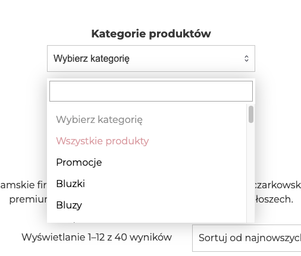
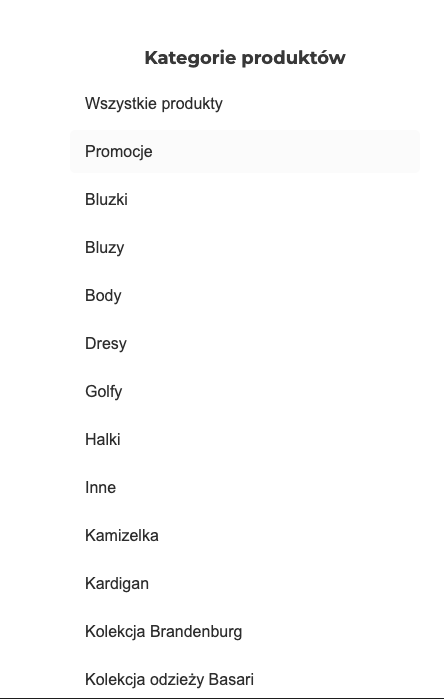

# WooCommerce Category Menu

Show simple category menu from Woocommerce using shortcode.

## Screenshots

## Installation

Download ZIP file and upload it to your WordPress site.

## Usage

Use shortcode `[print_category_woocommerce]` to show category menu.
